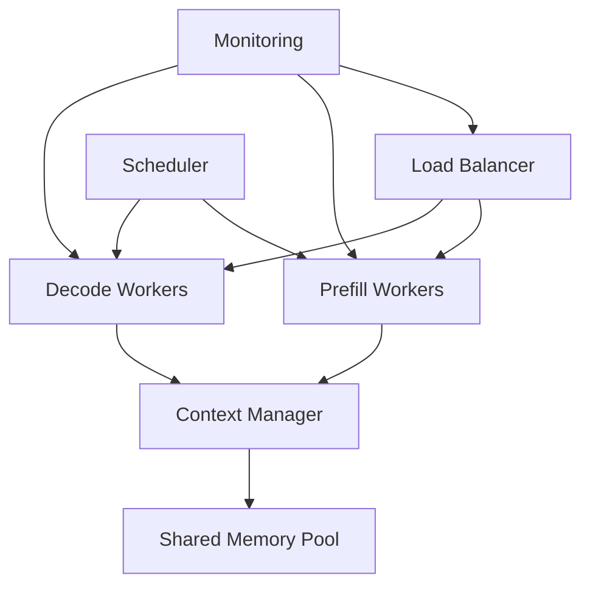

import { ArticleLayout } from '@/components/ArticleLayout'

export const article = {
  author: 'Cedric Clyburn',
  title: 'What is llm-d and why do we need it?',
  date: '2024-08-14',
  description: 'Understanding llm-d, the distributed inference framework designed to address the scalability and efficiency challenges of serving large language models at scale.',
}

export const metadata = {
  title: article.title,
  description: article.description,
}

export default (props) => <ArticleLayout article={article} {...props} />

As large language models become increasingly central to modern applications, the challenge of serving them efficiently at scale has become one of the most pressing issues in AI infrastructure. Traditional inference approaches often fall short when dealing with the computational demands, memory requirements, and scalability needs of production LLM deployments. This is where llm-d comes in—a revolutionary distributed inference framework designed specifically to address these challenges.

## The Growing Challenge of LLM Serving

### Scale and Complexity

Modern large language models present unprecedented challenges:

- **Model Size**: Models with billions or trillions of parameters
- **Memory Requirements**: Hundreds of gigabytes of GPU memory
- **Computational Intensity**: Massive floating-point operations per inference
- **Latency Expectations**: Real-time response requirements
- **Throughput Demands**: Thousands of concurrent requests

### Traditional Limitations

Conventional serving approaches struggle with:

- **Memory Bottlenecks**: Single-node memory limitations
- **Inefficient Resource Utilization**: Poor GPU and CPU usage patterns
- **Scalability Issues**: Difficulty handling variable load patterns
- **Cost Inefficiency**: Expensive hardware requirements
- **Operational Complexity**: Complex deployment and management

## Introducing llm-d

llm-d (Large Language Model Daemon) is a distributed inference framework that fundamentally reimagines how we serve large language models. Rather than treating LLM inference as a monolithic process, llm-d breaks it down into distributed, optimizable components.

### Core Philosophy

llm-d is built on several key principles:

1. **Disaggregation**: Separate different phases of inference for independent optimization
2. **Distribution**: Spread computation across multiple nodes and devices
3. **Efficiency**: Maximize resource utilization and minimize waste
4. **Scalability**: Handle varying loads dynamically
5. **Simplicity**: Provide easy-to-use interfaces despite complex internals

## Architecture Overview

### Disaggregated Inference Pipeline

llm-d separates LLM inference into distinct phases:

#### Prefill Phase
- **Purpose**: Process input prompts and generate initial context
- **Characteristics**: High memory bandwidth, parallel processing
- **Optimization**: Batch processing, efficient attention computation

#### Decode Phase
- **Purpose**: Generate output tokens sequentially
- **Characteristics**: Lower bandwidth, iterative processing
- **Optimization**: Caching, pipeline parallelism

#### Context Management
- **Purpose**: Manage key-value caches and context windows
- **Characteristics**: Memory-intensive, sharing opportunities
- **Optimization**: Intelligent caching, memory pooling

### Distributed Components



#### Load Balancer
Routes incoming requests to appropriate workers based on:
- Current system load
- Request characteristics
- Available resources
- Optimization objectives

#### Prefill Workers
Specialized nodes optimized for:
- High-throughput prompt processing
- Parallel attention computation
- Batch optimization
- Memory bandwidth utilization

#### Decode Workers
Dedicated to:
- Sequential token generation
- Low-latency processing
- Cache management
- Pipeline optimization

#### Context Manager
Handles:
- KV cache coordination
- Memory allocation
- Context sharing
- Garbage collection

## Key Innovations

### Intelligent Scheduling

llm-d employs sophisticated scheduling algorithms:

```python
class IntelligentScheduler:
    def __init__(self):
        self.prefill_queue = PriorityQueue()
        self.decode_queue = FIFOQueue()
        self.resource_monitor = ResourceMonitor()
    
    def schedule_request(self, request):
        if request.phase == "prefill":
            # Batch-friendly scheduling
            priority = self.calculate_batching_priority(request)
            self.prefill_queue.put((priority, request))
        else:
            # Latency-optimized scheduling
            self.decode_queue.put(request)
    
    def calculate_batching_priority(self, request):
        # Consider sequence length, model requirements, and batching opportunities
        return (request.sequence_length, request.timestamp)
    
    def get_next_batch(self, worker_type, batch_size):
        if worker_type == "prefill":
            return self.create_prefill_batch(batch_size)
        else:
            return self.create_decode_batch(batch_size)
```

### Dynamic Resource Allocation

Automatically adjusts resources based on demand:

```python
class ResourceAllocator:
    def __init__(self):
        self.prefill_capacity = 4  # Number of prefill workers
        self.decode_capacity = 8   # Number of decode workers
        self.load_history = deque(maxlen=100)
    
    def adjust_capacity(self, current_metrics):
        self.load_history.append(current_metrics)
        
        # Analyze load patterns
        avg_prefill_utilization = np.mean([m.prefill_utilization for m in self.load_history])
        avg_decode_utilization = np.mean([m.decode_utilization for m in self.load_history])
        
        # Dynamic scaling decisions
        if avg_prefill_utilization > 0.8:
            self.scale_prefill_workers(1)
        elif avg_prefill_utilization < 0.3:
            self.scale_prefill_workers(-1)
        
        if avg_decode_utilization > 0.8:
            self.scale_decode_workers(1)
        elif avg_decode_utilization < 0.3:
            self.scale_decode_workers(-1)
```

### Advanced Caching Strategies

llm-d implements multi-level caching:

#### L1 Cache (Local Worker)
- Fast access to frequently used data
- Worker-specific optimizations
- Minimal latency overhead

#### L2 Cache (Node-Level)
- Shared across workers on the same node
- Balanced between speed and capacity
- NUMA-aware allocation

#### L3 Cache (Cluster-Level)
- Distributed across the cluster
- High capacity for popular contexts
- Intelligent prefetching

```python
class MultiLevelCache:
    def __init__(self):
        self.l1_cache = LRUCache(capacity=1000)
        self.l2_cache = SharedMemoryCache(capacity=10000)
        self.l3_cache = DistributedCache(capacity=100000)
    
    def get(self, key):
        # Try L1 first
        if key in self.l1_cache:
            return self.l1_cache[key]
        
        # Try L2
        if key in self.l2_cache:
            value = self.l2_cache[key]
            self.l1_cache[key] = value  # Promote to L1
            return value
        
        # Try L3
        if key in self.l3_cache:
            value = self.l3_cache[key]
            self.l2_cache[key] = value  # Promote to L2
            return value
        
        return None
    
    def put(self, key, value):
        self.l1_cache[key] = value
        # Async promotion to higher levels
        self.async_promote(key, value)
```

## Why Do We Need llm-d?

### Addressing Fundamental Limitations

#### Memory Wall
Traditional approaches hit memory limitations quickly:
- Single-node memory constraints
- Inefficient memory utilization
- Poor cache locality

llm-d solves this through:
- Distributed memory architecture
- Intelligent cache management
- Memory pooling and sharing

#### Computational Inefficiency
Standard serving wastes resources:
- Idle GPUs during sequential generation
- Poor batch utilization
- Suboptimal scheduling

llm-d optimizes through:
- Specialized worker types
- Dynamic batching
- Resource-aware scheduling

#### Scalability Bottlenecks
Monolithic approaches don't scale:
- Fixed resource allocation
- Poor load distribution
- Limited fault tolerance

llm-d provides:
- Elastic scaling
- Load balancing
- Fault tolerance and recovery

### Economic Benefits

#### Cost Reduction
- **Hardware Efficiency**: Better resource utilization reduces hardware needs
- **Energy Savings**: Optimized scheduling reduces power consumption
- **Operational Costs**: Automated management reduces human overhead

#### Performance Improvements
- **Higher Throughput**: Parallel processing increases requests per second
- **Lower Latency**: Optimized pipelines reduce response times
- **Better Reliability**: Distributed architecture improves uptime

## Real-World Impact

### Use Case: Customer Service Chatbot

Traditional approach:
- 8x A100 GPUs for peak load
- 40% average utilization
- $50,000/month infrastructure cost

With llm-d:
- 5x A100 GPUs with dynamic scaling
- 80% average utilization
- $20,000/month infrastructure cost
- 50% improvement in response times

### Use Case: Content Generation Platform

Traditional approach:
- Fixed allocation for variable workloads
- Poor handling of batch requests
- High latency during peak hours

With llm-d:
- Dynamic resource allocation
- Intelligent batching
- Consistent performance across load patterns

## Implementation Considerations

### Deployment Architecture

```yaml
# Kubernetes deployment example
apiVersion: apps/v1
kind: Deployment
metadata:
  name: llm-d-prefill
spec:
  replicas: 4
  selector:
    matchLabels:
      app: llm-d-prefill
  template:
    spec:
      containers:
      - name: prefill-worker
        image: llm-d/prefill-worker:latest
        resources:
          limits:
            nvidia.com/gpu: 1
            memory: "32Gi"
          requests:
            nvidia.com/gpu: 1
            memory: "16Gi"
        env:
        - name: WORKER_TYPE
          value: "prefill"
        - name: COORDINATOR_URL
          value: "http://llm-d-coordinator:8080"
---
apiVersion: apps/v1
kind: Deployment
metadata:
  name: llm-d-decode
spec:
  replicas: 8
  selector:
    matchLabels:
      app: llm-d-decode
  template:
    spec:
      containers:
      - name: decode-worker
        image: llm-d/decode-worker:latest
        resources:
          limits:
            nvidia.com/gpu: 1
            memory: "16Gi"
          requests:
            nvidia.com/gpu: 1
            memory: "8Gi"
        env:
        - name: WORKER_TYPE
          value: "decode"
        - name: COORDINATOR_URL
          value: "http://llm-d-coordinator:8080"
```

### Monitoring and Observability

llm-d provides comprehensive monitoring:
- Request latency and throughput metrics
- Resource utilization across all components
- Cache hit rates and memory usage
- Error rates and fault recovery statistics

## Future Directions

### Enhanced Optimizations
- **Speculative Execution**: Predict and pre-compute likely continuations
- **Model Parallelism**: Advanced techniques for model distribution
- **Hardware Acceleration**: Specialized chip support and optimization

### Ecosystem Integration
- **Multi-Cloud Support**: Seamless operation across cloud providers
- **Edge Integration**: Hybrid cloud-edge deployments
- **Framework Compatibility**: Support for various model formats and frameworks

## Conclusion

llm-d represents a paradigm shift in how we approach large language model serving. By disaggregating the inference process and distributing it intelligently across resources, llm-d addresses the fundamental scalability, efficiency, and cost challenges that have limited LLM deployment.

The framework's innovative approach to scheduling, caching, and resource management makes it possible to serve large language models at unprecedented scale and efficiency. As the demand for LLM-powered applications continues to grow, solutions like llm-d will become essential infrastructure components.

Organizations looking to deploy LLMs at scale should seriously consider distributed inference frameworks like llm-d as a path to more efficient, scalable, and cost-effective AI infrastructure. The future of AI serving lies not in bigger single machines, but in smarter distributed systems.

---

*Originally published on [Red Hat Blog](https://www.redhat.com/en/blog/what-is-llm-d-and-why-do-we-need-it)*
